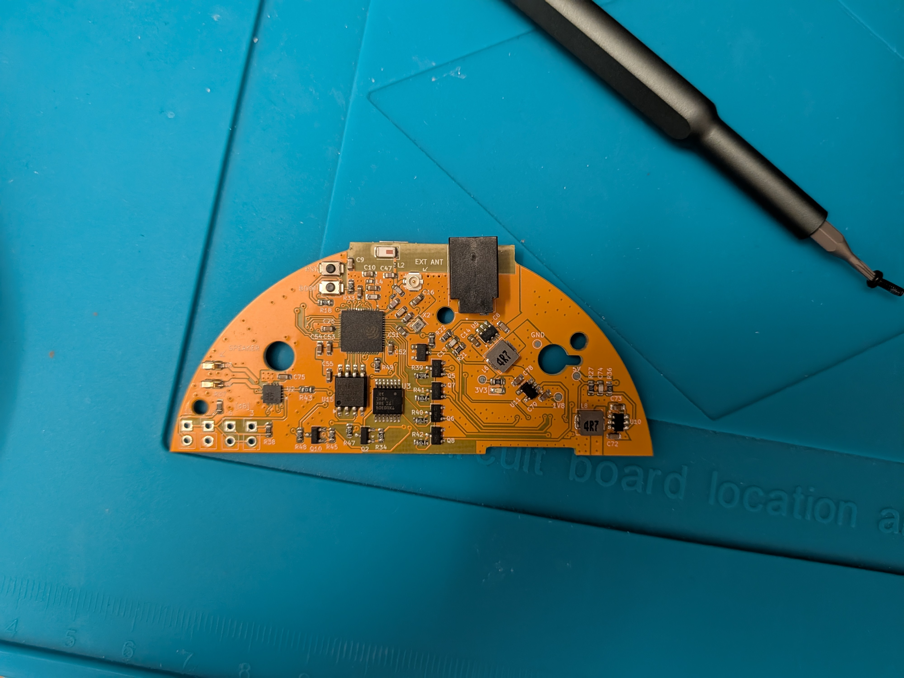

This is a retrofit project that lets you swap out the Echo Dot's original motherboard with a custom one that connects to Home Assistant. You keep everything that works — the original speaker, 4-mics array, LED ring, and buttons — and gain full local control without any Amazon servers involved.  

**Current Status**  
This is the **first working prototype**. It's functional but not perfect yet — there are a few things that need tweaking, which we'll address as we go. Follow the development on [Home Assistant Community Forum](https://community.home-assistant.io/t/re-using-an-echo-dot-3rd-gen-with-voice-assistant/1020256/17)

**Video**  
[Check out the prototype in action](Images/PXL_20260810_205850717~2.mp4 "Images/PXL_20260810_205850717~2.mp4")  
